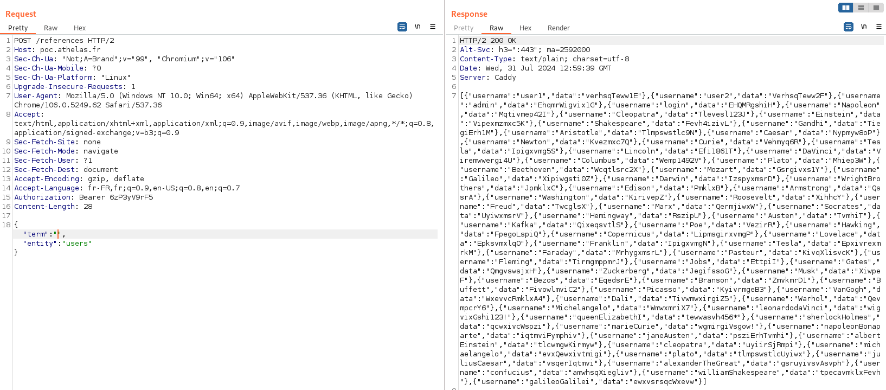

# Password gathering on "usertwist" web service
## Issue Description
The issue allows anyone to use one user/password combo to get the full list of users and their passwords.

## Affected URL/Area
- https://poc.athelas.fr/login (Get Bearer token)
- https://poc.athelas.fr/references (Use the token obtained previously to gather the full list of users)

## Risk Rating
- Risk: Critical
- Difficulty to Exploit: Medium (The user needs good understandings of reverse engineering and brute-force tools)
- CVSS3 Score [7.5](https://nvd.nist.gov/vuln-metrics/cvss/v3-calculator?vector=AV:N/AC:L/PR:N/UI:N/S:U/C:H/I:N/A:N&version=3.1)
- User needs to get some creds to exploit the vulnerability (68 users available and most of them have a weak password)

### Impact
- Sensitive data leaks (Passwords / Bearer tokens)
- Company reputation

## Steps to reproduce/PoC
The exploit can be reproduced in 6 steps :
1. Decompile the usertwist binary with Ghidra (Can be downloaded from [a public Gitea repository](https://git.athelas-conseils.fr/Stage/ansible_playbooks/src/branch/main/files))

2. Find the AuthorizedUsers array and pick the username you want (You can't see all the users because of ghidra's limitations but you only need one so pick admin for example)


3. Find the 68 passwords written in **plain text** in the binary and put them in a wordlist (Take a look at models.init you should find all the variables)


4. Now use a tool like burp intruder to brutforce the /login endpoint by editing the HTTP request. If you get 401, username / password invalid. 200 means the password was sucessfully found.
You need to edit the following fields in the HTTP request before starting the attack
    - The method (POST instead of GET)
    - The JSON object (Create a JSON object containig username & password fields)

    
    

5. Now we have a username, a password and a bearer token returned by the server. We can use this token to connect to the /references endpoint using burp repeater to edit the request. This time we're gonna edit 3 fields :
    - The method (POST instead of GET)
    - The Authorization field (Authorization: Bearer \<found_token\>)
    - The JSON (Create a JSON object containig term & entity fields)
        - term = A regex to select which user(s) we want to get infos. Leave empty to get the full list.
        - entity = Set "users" if you don't want to get the beautiful 418 error
    
    
    The server will return a list of json objects following this pattern
    ```json
    {"username":"<username>", "data":"<encrypted user's password>"}
    ```

6. Finally, we want to decrypt the passwords. After investigating the handlers.Login function in the binary, we understand that the encryption used is simple Caesar Code with an offset of 4.  
   
Cesar code is a symetrical algorithm. That means we can easily decrypt the passwords using any [Cesar decryption tool](https://www.dcode.fr/chiffre-cesar).
We should find the password we used on step 4 as well as any other password.


## Affected Demographic/User Base 
- This issue affects all the users who have an account on the web service.
- The vulnerability come from a bad encryption algorithm and the possibility to get anyone's password (even encrypted) from a single request !

## Recommended Fix
- Use an asymetrical algorithm (BCrypt is pretty popular for password encryption in databases)
- Remove the /references endpoint (It has nothing to do here)
    - Instead of giving a user his password back, give him the opportunity to change it.
    - The passwords, even encrypted, should **NEVER** be accessed from anyone.
- Remove the passwords from the binary. Store them in a secured database and request them if needed (Obviously don't store the database password neither. You can set it in an ENV var like it was done for the TCP port opened for the service.)
- Remove the binary from Gitea (or set the repository private). This program shouldn't be open source as it would help hackers to understand the way it works.

## References
Include additional reading for the client to further backup the issues explained or elaborate more on other potential issues chained to the one identified.
- [1] [BCrypt algorithm explanations](https://en.wikipedia.org/wiki/Bcrypt)
- [2] [Regex explanations](https://www.geeksforgeeks.org/regular-expressions-in-c/) (for users searching on /references)
- [3] [Bearer Tokens operation mode](https://www.geeksforgeeks.org/regular-expressions-in-c/)
- [4] [Learn more about Bearer Tokens](https://jwt.io/introduction)
